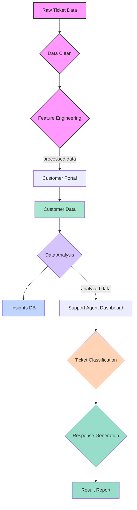

# 🎯 Support Copilot

A powerful AI-powered toolkit to streamline customer support by reusing knowledge from past tickets.

## 🏗️ System Architecture

Our system consists of three main pipelines:

### 1. Company Data Ingestion Pipeline
- Raw ticket data processing
- Data cleaning and validation
- Feature engineering for ML models

### 2. Customer Support Pipeline
- Customer portal integration
- Real-time data analysis
- Insights database for trend analysis

### 3. Team Support Pipeline
- Support agent dashboard
- Intelligent ticket classification
- AI-assisted response generation
- Performance reporting



## 🚀 Current Status

- ✅ BigQuery integration complete
- ✅ Data pipeline configuration
- 🔄 ML model integration (in progress)
- 🔄 Response generation (planned)

## 💻 Tech Stack

- FastAPI backend
- Google BigQuery for data storage
- ML models for classification
- Authentication system
- Real-time analytics

## 🛠️ Getting Started

1. Set up environment:
```bash
python -m venv venv
source venv/bin/activate
pip install -r requirements.txt
```

2. Configure credentials:
- Set up `.env` file with BigQuery credentials:
  ```env
  GOOGLE_CLOUD_PROJECT=your-project-id
  GOOGLE_APPLICATION_CREDENTIALS=service-account.json
  ```
- Configure service account access

3. Run the application:
```bash
uvicorn app.main:app --reload
```

## 📊 Features

- Real-time ticket analysis
- ML-powered classification
- Response suggestions
- Performance metrics
- Data-driven insights

## 🔒 Security

- Secure credential management
- Role-based access control
- Data encryption
- Audit logging

## 🤝 Contributing

1. Fork the repository
2. Create a feature branch
3. Follow our development guidelines
4. Submit a pull request

## 📄 License

MIT License - see LICENSE file for details.